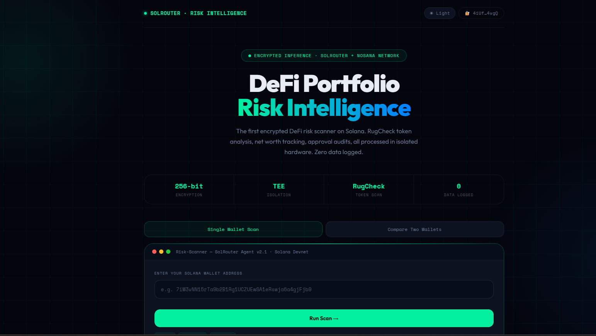
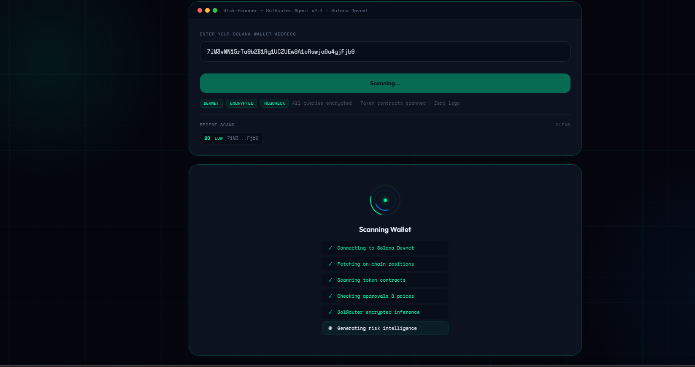
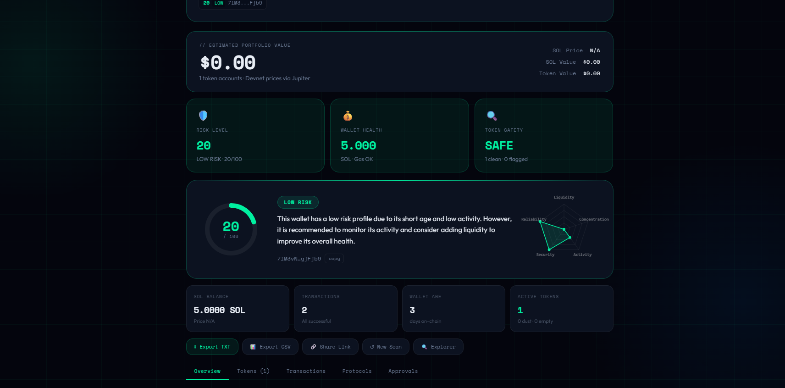
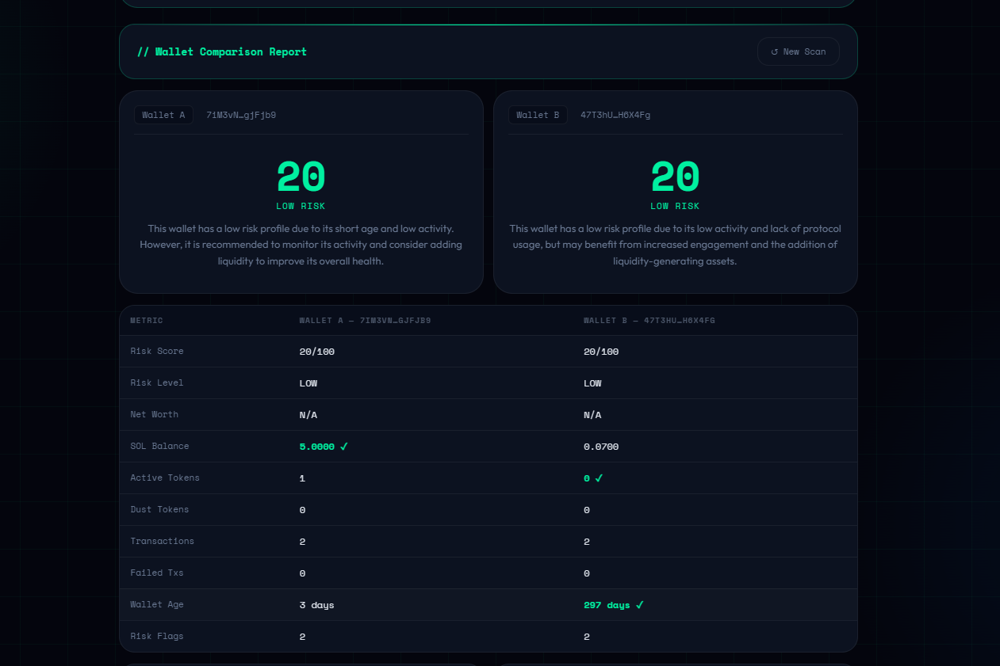

# 🔐 SolRouter DeFi Portfolio Risk Intelligence

> The first encrypted DeFi risk scanner on Solana — powered by SolRouter's private inference engine. Your wallet data is encrypted before leaving your device, processed inside isolated hardware, and never logged anywhere.

**Built by [OlaTech IT](https://x.com/Olamiayan)**  
**Powered by [SolRouter](https://solrouter.com) · [Nosana Network](https://nosana.io) · [Solana](https://solana.com)**

---
## 📸 Screenshots

### Risk Dashboard


### Scan Results


### Token Analysis with RugCheck


### Wallet Comparison


## 🧠 What It Does

This tool scans any Solana wallet and generates a comprehensive risk intelligence report using **SolRouter's encrypted inference** — so your wallet address, token balances, and strategy are never exposed to any public server.

### Why Privacy Matters for DeFi
When you analyze a portfolio using a standard AI API (OpenAI, Anthropic, etc.), your wallet address, token balances, and strategy are sent as **plaintext to a centralized server**. This means:
- Your positions could be front-run
- Your strategy could be leaked or logged permanently
- Your wallet is tied to your queries forever

SolRouter solves this by encrypting your query **before it leaves your device**, processing it inside a **Trusted Execution Environment (TEE)** on Nosana's decentralized GPU network, and routing through Solana — so inference is both private and verifiable.

---

## ✨ Features

### Risk Intelligence
- **Risk Score (0–100)** — quantitative score with animated gauge
- **5-Dimension Radar Chart** — Liquidity, Concentration, Activity, Security, Reliability
- **3-Traffic-Light Health Card** — instant visual summary at the top
- **Smart Alert Banners** — dynamic warnings for approvals, rug tokens, dust, zero SOL
- **Dimension Tooltips** — hover any bar for plain-English explanation

### Token Analysis
- **RugCheck Integration** — every SPL token scanned via [rugcheck.xyz](https://rugcheck.xyz) — GOOD / WARN / DANGER per token
- **Live USD Values** — via Jupiter Price API
- **Dust Token Detection** — flags potential scam airdrops
- **Net Worth Banner** — total portfolio value in USD

### Security
- **Token Approval Auditor** — lists every delegated token approval with spender address and amount
- **Protocol Detection** — identifies interactions with Marinade, Jupiter, Orca, Raydium, Solend, and more
- **Known Exploit Flagging** — warns if wallet holds tokens from known hacked protocols

### Wallet Intelligence
- **Transaction History** — last 10 txs with status, timestamp, live explorer links
- **Wallet Age & Activity Score** — on-chain history depth analysis
- **Failed Transaction Rate** — reliability risk dimension

### UX & Export
- **Compare Two Wallets** — full side-by-side comparison with stats table, flags, tokens, dimensions
- **Export TXT Report** — full report as downloadable text file
- **Export CSV** — token holdings with RugCheck scores for tax/records
- **Shareable URL** — pre-load any wallet via `?wallet=...`
- **Recent Scans** — session-based quick-access chips (per browser session, private)
- **Light / Dark Mode** — full theme support
- **Fully Responsive** — works on all screen sizes from 375px to desktop

### Inference Architecture
3-tier fallback system — always get live results:
```
1️⃣  SolRouter  →  Encrypted TEE inference via Nosana (primary)
2️⃣  Groq       →  Free Llama 3.1 fallback (14,400 req/day free)
3️⃣  Claude     →  Optional Anthropic fallback
4️⃣  On-device  →  Always works — uses real on-chain data
```

---

## ⚙️ Setup

### Prerequisites
- Node.js v18+
- SolRouter account → [solrouter.com](https://solrouter.com)
- Free Groq key → [console.groq.com](https://console.groq.com) (no credit card)
- Free devnet USDC → [faucet.circle.com](https://faucet.circle.com) (select Solana Devnet)

### Install

```bash
git clone https://github.com/youngprogrammer11/solrouter-defi-scanner
cd solrouter-defi-scanner
npm install
```

### Configure

```bash
cp .env.example .env
```

Edit `.env` with your real keys:

```env
SOLROUTER_API_KEY=sk_solrouter_YOURKEYHERE
GROQ_API_KEY=gsk_YOURKEYHERE
ANTHROPIC_API_KEY=sk-ant-YOURKEYHERE
SOLANA_RPC_URL=https://api.devnet.solana.com
WALLET_ADDRESS=YOUR_SOLANA_WALLET_ADDRESS
```

> ⚠️ Never commit your `.env` file. It is already in `.gitignore`.

### Run

```bash
npm start
```

Open **http://localhost:3000** in your browser.

### CLI Mode (terminal only)

```bash
npm run scan
```

---

## 🗂 Project Structure

```
solrouter-defi-scanner/
├── server.js        ← Express web server (UI + API endpoints)
├── index.js         ← CLI runner
├── portfolio.js     ← Solana on-chain data fetcher
│                      (SOL balance, SPL tokens, txs, protocol detection)
├── analyzer.js      ← 3-tier inference: SolRouter → Groq → Claude → On-device
├── rugcheck.js      ← RugCheck.xyz token contract scanner
├── approvals.js     ← Token delegation approval checker
├── prices.js        ← Jupiter Price API for live USD token values
├── public/
│   └── index.html   ← Full web dashboard (single file, no framework)
├── .env             ← Your real keys (never commit this)
├── .env.example     ← Template for setup
└── README.md
```

---

## 🔌 API Endpoints

```
POST /api/scan
  Body:    { wallet: string }
  Returns: { portfolio, report, approvals }

POST /api/compare
  Body:    { walletA: string, walletB: string }
  Returns: { a: { portfolio, report }, b: { portfolio, report } }

GET /api/health
  Returns: { ok: true, rpc: string }
```

---

## 🔒 How Encryption Works

```
1. Client-side     → Wallet data composed into analysis prompt
2. SolRouter SDK   → Prompt encrypted before leaving your device
3. Nosana Network  → Processed inside TEE (Trusted Execution Environment)
4. Solana          → Results routed through decentralized infrastructure
5. Zero logs       → No centralized server ever sees your raw query
```

---

## 📸 Demo

```
╔══════════════════════════════════════════╗
║  🔐 SolRouter DeFi Risk Scanner v2.1    ║
╚══════════════════════════════════════════╝

   SolRouter attempt 1/2...
   ⏳ Cold start — retrying in 8s...
   SolRouter attempt 2/2...
   Trying Groq API fallback...
   ✅ Groq API fallback successful

Risk Score:    61 / 100      Risk Level: MEDIUM
Net Worth:     $0.42 USD
SOL Balance:   0.0000 SOL   Wallet Age:  5 days
Active Tokens: 1             Transactions: 3

🚩 Risk Flags:
   • Zero SOL balance — cannot pay transaction fees
   • Single active token — high concentration risk
   • Low transaction history — wallet relatively new

💡 Recommendations:
   • Fund wallet with at least 0.05 SOL for gas fees
   • Spread across 3–5 assets to reduce concentration
   • Build on-chain history before committing capital

✅ Analysis complete — 3-tier encrypted inference
```

---

## 🔗 Resources

- [SolRouter](https://solrouter.com) — Private AI inference on Solana
- [SolRouter Docs](https://www.solrouter.com/docs)
- [SolRouter on X](https://x.com/SolRouterAI)
- [SolRouter Telegram](https://t.me/+uEgTRV5CivVmYTRi)
- [Nosana Network](https://nosana.io) — Decentralized GPU compute
- [Groq Console](https://console.groq.com) — Free AI inference
- [RugCheck](https://rugcheck.xyz) — Solana token security
- [Jupiter Price API](https://price.jup.ag) — Token prices
- [Circle Faucet](https://faucet.circle.com) — Free devnet USDC

---

## 📜 License

MIT — Built by [OlaTech IT](https://x.com/Olamiayan)
